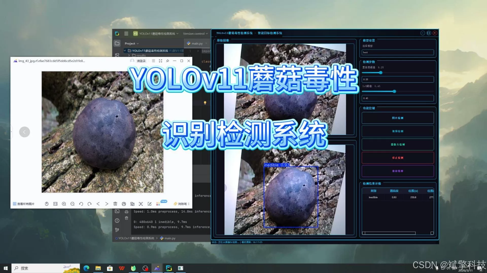
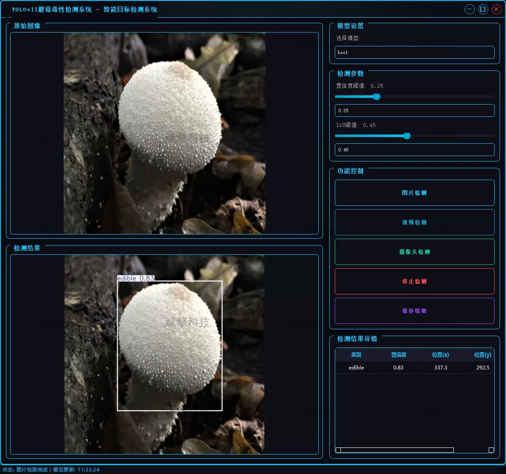
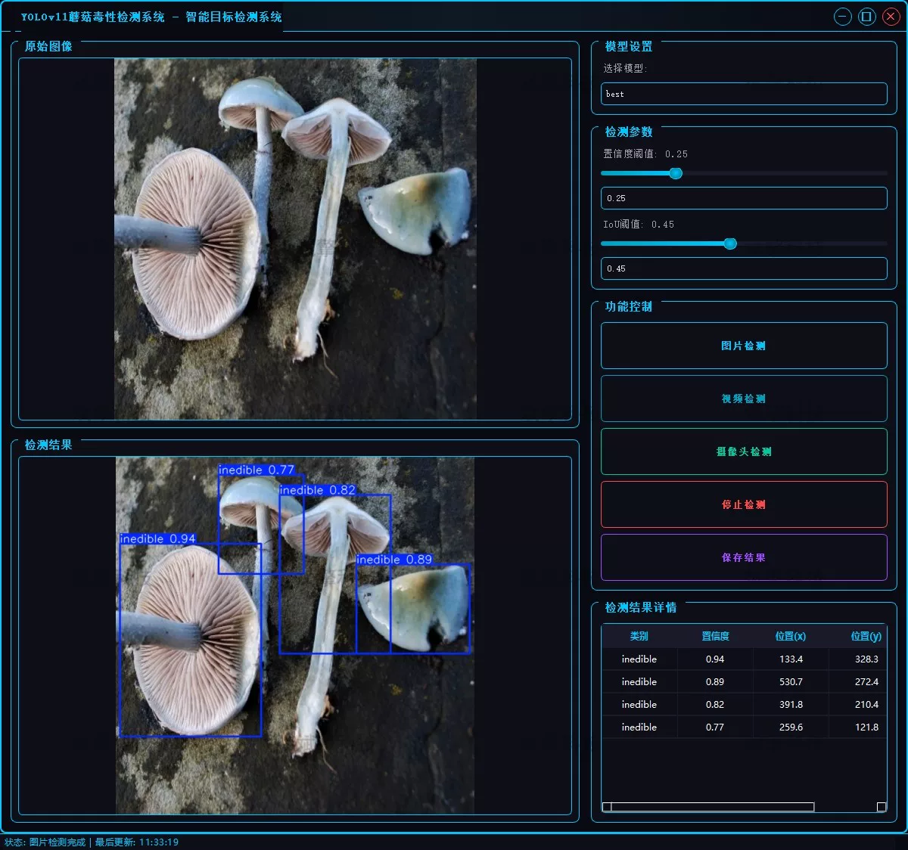
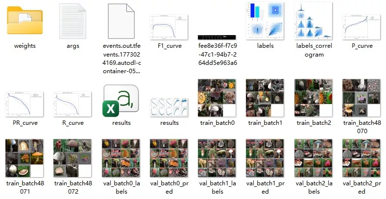
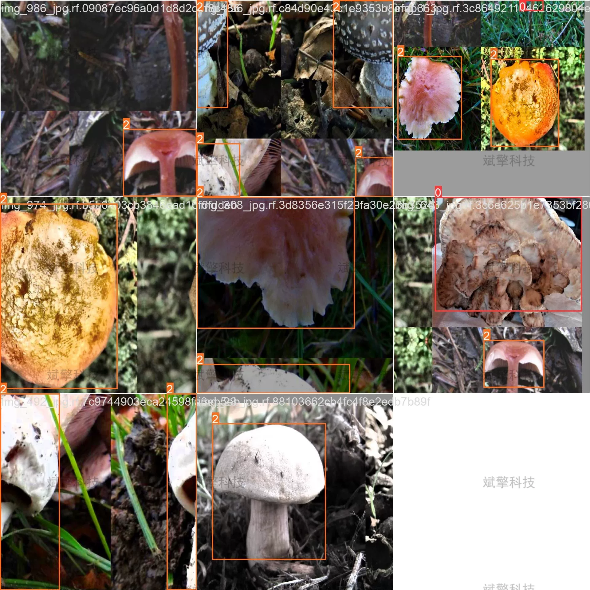

# Based on YOLOv11 deep learning for mushroom toxicity detection system (YOLOv11)

## Body

The project is based on the YOLOv11 (You Only Look Once v11) lightweight deep learning object detection algorithm to build an end-to-end mushroom toxicity detection system. It aims to solve the problems of relying on professional knowledge for traditional mushroom toxicity identification, low efficiency, and easy errors. The system is designed for general users, food safety supervisors, and field workers, providing three core functions: image detection, video real-time detection, and camera real-time detection. It can quickly identify and classify the toxicity category of mushrooms, providing intelligent and convenient decision support for mushroom consumption safety.

As the latest generation of YOLO series algorithms, YOLOv11 not only maintains high accuracy but also optimizes the model inference speed and parameter size, adaptable to different hardware environments (such as PCs and embedded devices). The system divides mushroom samples into three categories (inedible, poisonous, edible), and through deep training on labeled data, realizes rapid localization and toxicity classification of mushroom targets, effectively reducing the safety risks caused by accidentally eating poisonous mushrooms.

Project Functionality Display

✅ User Login and Registration: Supports password verification and security validation.

✅ Three Detection Modes: Based on the YOLOv11 model, supports image, video, and real-time camera detection, accurately identifying targets.

✅ Dual-screen comparison: Displays original images and detection results on the same screen.

✅ Data Visualization: Real-time table displaying the category, confidence, and coordinates of detected targets.

✅ Intelligent Parameter Adjustment: Provides a confidence slide bar, dynamically optimizing detection accuracy to meet different scene needs.

✅ Sci-fi style interactive interface: Dark theme combined with dynamic light effects, reducing visual fatigue and improving operational experience.

✅ High-performance multi-thread architecture: Independent detection threads ensure smooth operation, real-time status prompts, and fast response without lag.

Dataset Introduction

Training set: 2019 images, used for model core parameters learning and feature extraction;
Validation set: 576 images, used for model hyperparameter tuning, overfitting monitoring, and performance evaluation during training;
Test set: 288 images, used for independent validation of the model's generalization ability and final detection effect.

## Images

## Payment

Here is a pay link on Stripe ( https://buy.stripe.com/3cs8yP7sY87d0vu9AB ). Please contact me lonlonago@foxmail.com after funding $89, and I will send you a complete data files , thank you!

